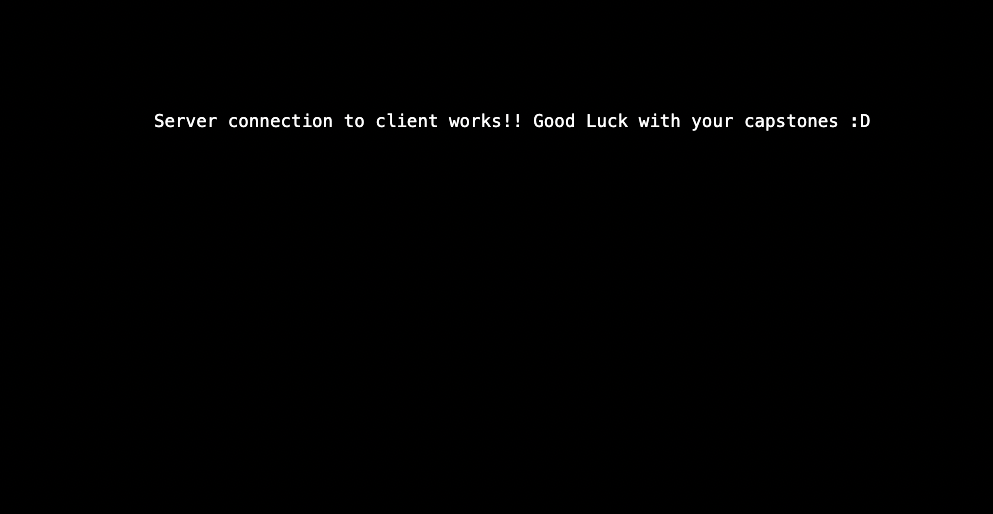

# Capstone Client Template

### To start the Client

run the command `yarn && yarn start`. This will install all the dependencies and build the docker image

### To install packages

when you run `yarn add PACKAGE` the package will be installed in docker as well automatically. However if you run into issues, you need to stop the server first with `yarn stop` then you can run `yarn build` to rebuild the docker image and start again.

### To prune the containers and data

> ⚠️ WARNING: This is a destructuve command that would delete the containers and all the data inside like database data, and uploads
> you can run `yarn prune` to shutdown the server and delete all the volumes associated with it. This serves as a start fresh command, that will return your server environment to original. It will not affect your code changes though.

## Starter Code

In this project folder, you will find:

A component called `Test` where there's an API call to the endpoint `/test` if you did everything correctly visiting your `http://localhost:3000/`u should see this

Now the rest is for you to build on your own 😁
